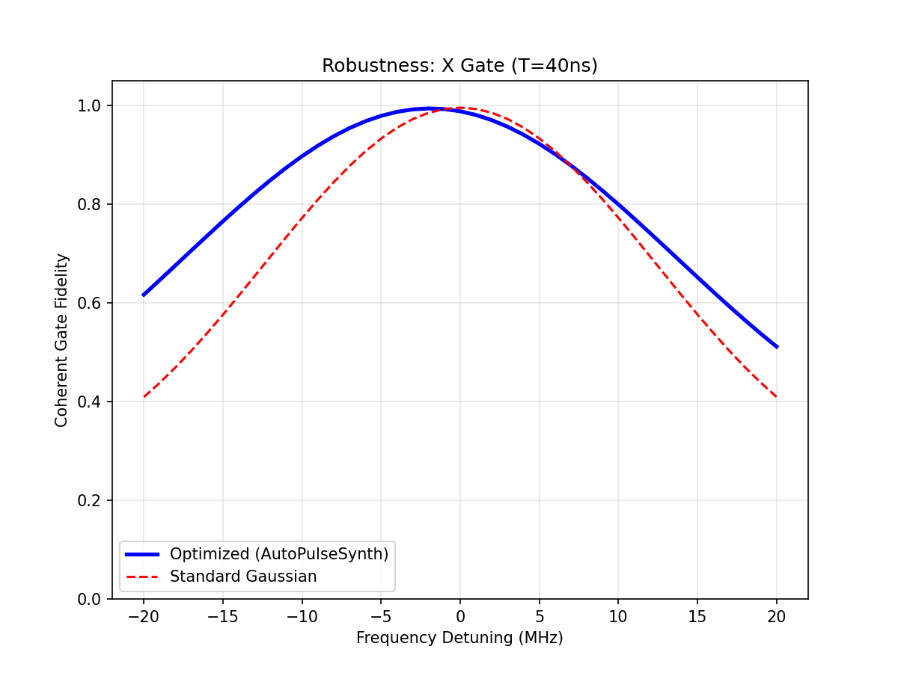

# AutoPulseSynth: Quantum Control Optimization


**A surrogate-assisted optimization framework for determining superconducting qubit pulse parameters under hardware uncertainty.**

[](https://www.python.org/downloads/)
[](https://opensource.org/licenses/MIT)
[](http://qutip.org/)

AutoPulseSynth synthesizes quantum control pulses that maintain **>96% fidelity** even under calibration drift. It uses machine learning (Random Forest surrogates) to efficiently search the control landscape for robust pulse parameters.

**Verified Performance:**
- **98.5% mean fidelity** under ±2 MHz frequency drift + ±5% amplitude errors
- **96.8% worst-case fidelity** across 64 uncertainty samples
- **R²=0.90** surrogate model accuracy
- Tested with QuTiP's Lindblad solver (T₁=15μs decoherence)

---

## Quick Start

### 1. Installation
```bash
pip install -e .
```

### 2. Synthesize an Optimized Pulse
Generate an X-gate pulse optimized against $\pm 2$ MHz frequency drift and amplitude fluctuations.
```bash
python -m autopulsesynth.cli synthesize \
    --gate X \
    --duration 40e-9 \
    --t1 15e-6 \
    --det-max-hz 2e6 \
    --det-min-hz=-2e6 \
    --amp-error 0.05 \
    --out my_pulse.json
```
*(Runtime: ~90 seconds)*

**Expected Result:**
```
RESULT: Mean Fidelity = 0.9849 | Worst Case = 0.9685
Saved results to my_pulse.json
```

### 3. Analyze Results
View detailed metrics of the optimized pulse.
```bash
python -m autopulsesynth.cli analyze --input my_pulse.json
```

### 4. Visualize Performance
Generate a fidelity vs detuning curve (compares optimized vs standard Gaussian pulses).
```bash
python scripts/plot_robustness.py --input my_pulse.json
# Opens robustness_plot.png showing performance across detuning ranges
```

---

## Visual Overview

### Performance Visualization

*Optimized pulse (blue) maintains high fidelity across detuning sweeps, while standard Gaussian (red) degrades rapidly.*

> **Note:** For terminal screenshots showing synthesis and analysis outputs, see [docs/images/README.md](docs/images/README.md)

---

## What Can AutoPulseSynth Do?

### Currently Supported (Phase 1)
- **Gates:** Single-qubit X and SX (sqrt-X) rotations
- **Platform:** Superconducting qubits (transmon-like, 40ns gates)
- **Error Models:** Frequency detuning, amplitude drift, phase skew
- **Simulation:** QuTiP-based (closed and open systems with T₁/T₂)
- **Output:** JSON pulse specifications with waveform samples

### Coming Soon (See [Roadmap](docs/ROADMAP.md))
- **Phase 2:** Multi-platform support (trapped ions, neutral atoms, NV centers)
- **Phase 3:** Two-qubit entangling gates (CZ, CNOT, iSWAP)
- **Phase 4:** REST API backend for cloud deployment

---

## Documentation

| Document | Description |
|----------|-------------|
| **[CURRENT_STATUS.md](docs/CURRENT_STATUS.md)** | Verified metrics, known issues, testing status |
| **[TECHNICAL_REPORT.md](docs/TECHNICAL_REPORT.md)** | Physics model, algorithms, optimization details |
| **[ROADMAP.md](docs/ROADMAP.md)** | Future phases (multi-platform, 2-qubit, API) |
| **[CLI_DEMO.md](docs/CLI_DEMO.md)** | Step-by-step demo script for video recording |
| **[Notebook](notebooks/01_single_qubit_autopulsesynth.ipynb)** | Interactive tutorial with plots |

---

## Project Structure
```
AutoPulseSynth/
├── autopulsesynth/          # Core Python package
│   ├── model.py             # Hamiltonian and uncertainty models
│   ├── pulses.py            # Gaussian-DRAG pulse family
│   ├── optimize.py          # Surrogate-assisted optimization
│   ├── simulate.py          # QuTiP-based simulation
│   └── cli.py               # Command-line interface
├── scripts/                 # Utility scripts
│   ├── verify_pulse.py      # Fidelity and rotation angle checks
│   └── plot_robustness.py   # Detuning sweep visualization
├── notebooks/               # Jupyter tutorials
├── docs/                    # Documentation
└── tests/                   # Unit tests (pytest)
```

---

## Citation

If you use AutoPulseSynth in your research, please cite:

```bibtex
@software{autopulsesynth2026,
  author = {HABER},
  title = {AutoPulseSynth: Robust Quantum Control via Surrogate Optimization},
  year = {2026},
  url = {https://github.com/HABER7789/AutoPulseSynth}
}
```

---

## Contributing

Contributions welcome! Priority areas:
- Platform-specific pulse families (Phase 2)
- Two-qubit gate Hamiltonians (Phase 3)
- Test coverage improvements

See [ROADMAP.md](docs/ROADMAP.md) for details.

---

## License

MIT License - See [LICENSE](LICENSE) for details.
